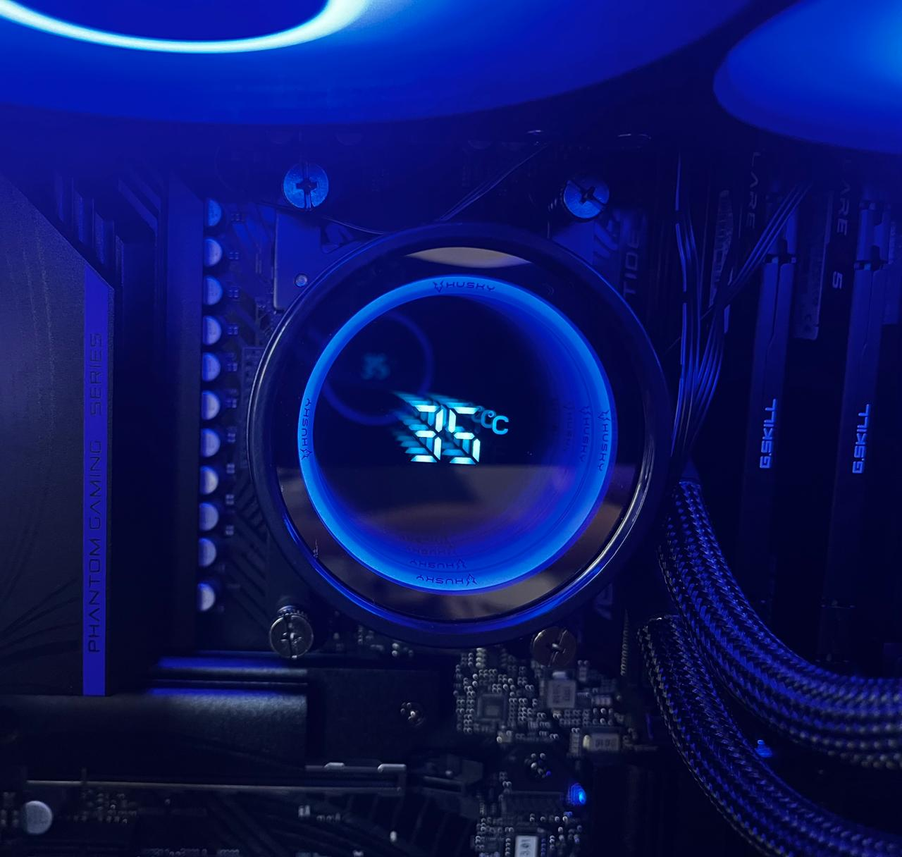

# CPU Cooler display on Linux

This script capture the CPU temperature and show on Water Cooler display on Linux.

Since the manufacture supply a software only for Windows.

Tested with Water Cooler Husky Glacier




## Requirements

- python
- python-hid
- python-psutil

## CPU temperature

This script is using tctl temperature from k10temp linux module. More details [here](https://www.kernel.org/doc/html/v5.6/hwmon/k10temp.html#:~:text=Tctl%20is%20the%20processor%20temperature,like%20die%20or%20case%20temperature.). Maybe is not the better choise, you can explore more available cpu temperature looking the result of `psutil.sensors_temperatures()`.

## How to run

First identifer the vendorId and productId of you device. You can use the `lsusb` utility on linux.

Than replace the `VENDER_ID` and `PRODUCT_ID` ON cpu_cooler.py script.

After, exec:

```bash
sudo python cpu_cooler.py
```

To run without `sudo` it's necessary to create an `udev rule` to allow you user access the device.

Create a file at `/etc/udev/rules.d/99-cpu-cooler.rules` with content: (replace `VENDOR-ID` and `PRODUCT-ID` with your vendor-id and product-id)

```bash
SUBSYSTEMS=="usb", ATTRS{idVendor}=="VENDOR-ID", ATTRS{idProduct}=="PRODUCT-ID", MODE="0666"
```

Update the udev rules:

```bash
sudo udevadm control --reload-rules
sudo udevadm trigger
```

Now check if you can run without sudo:

```bash
python cpu_cooler.py
```

## Run as service

To exec the script as service and show cpu cooler even after reboot, you can create a `systemd service`.

First, let's copy the `cpu_cooler.py` to `~/.local/bin` folder:

```bash
mkdir -p ~/.local/bin
cp cpu_cooler.py ~/.local/bin
```

Than, copy the `cpu-cooler.service` and enable the systemd service

```bash
cp cpu-cooler.service ~/.config/systemd/user
systemctl --user daemon-reload
systemctl --user enable cpu-cooler
systemctl --user start cpu-cooler
```
